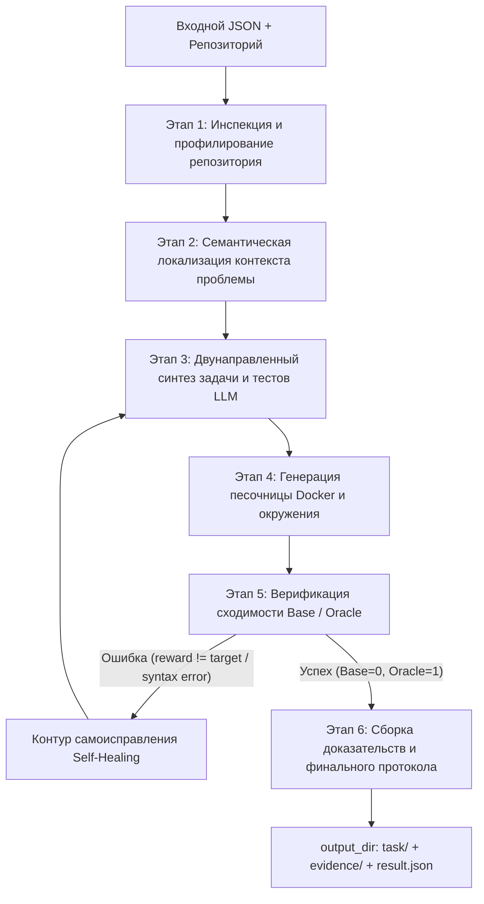

# Архитектура и этапы работы универсального харнесса (Benchmark Harness)

Документ определяет архитектурный дизайн, интерфейсы и пошаговый конвейер (пайплайн) автономного генератора тест-кейсов для оценки AI-разработчиков.

---

## 1. Концепция и фундаментальные принципы

### 1.1. Назначение системы
Харнесс — это автономный конвейер, который принимает на вход **исходный репозиторий** и **текстовый бриф** задачи, а на выходе выпускает **полноценный верифицированный бенчмарк-кейс** (`task/`), готовый к независимому тестированию AI-моделей в изолированном окружении, сопровождаемый доказательствами корректности (`evidence/`) и паспортом генерации (`result.json`).

### 1.2. Принципы проектирования
1. **Расширяемость (Language-Agnostic Core):**  
   Ядро пайплайна оперирует абстрактными этапами (Discovery, Localization, Synthesis, Sandbox, Convergence, Packaging). Текущая базовая реализация фокусируется на **Python-экосистеме** (включая базы данных, такие как PostgreSQL), но все компоненты вынесены за интерфейсы провайдеров (`IStackDetector`, `IEnvironmentBuilder`, `ITestRunner`), что позволяет в будущем подключить .NET, C/C++, Go или Rust без переписывания архитектуры.
2. **Никакого оверфиттинга и хардкода:**  
   В коде харнесса отсутствуют захардкоженные имена файлов (`NettingPolicy.py`, `interval.py` и т.д.) или специфичные для одной задачи условия. Поиск и модификация кода осуществляются динамически.
3. **Безопасность и фильтрация недоверенного контекста:**  
   Защита от Prompt Injection: данные из сторонних каталогов документации, логов и архивных тикетов изолируются или игнорируются при формировании промптов к LLM.
4. **Гарантированная сходимость (Self-Healing Loop):**  
   Сгенерированные решения и тесты проходят двойную проверку в Docker. При синтаксических или логических сбоях конвейер применяет рефлексию по логам ошибок и самоисправляется.
5. **Никакой тихой деградации LLM-шагов (Fail-Fast):**  
   Сбой любого вызова модели (транспорт, обрезка, невалидный или неполный ответ) — это явное исключение, которое доходит до `result.json` (`status: "failed"`, `failed_stage`, `error`). Эвристики существуют только как режимы, выбранные пользователем явно (`inspect --no-llm`, `--search-backend keyword`), и никогда не включаются из `except`. Допустим только ограниченный и залогированный повтор того же шага. Харнесс не переклассифицирует тесты и требования за модель: расхождение между спецификацией и вердиктом песочницы передаётся в лечение, а неустранимое — отсекается явно с записью в `limitations`. Контракт закреплён тестом `tests/test_no_silent_fallbacks.py`.

---

## 2. Общая схема конвейера



---

## 3. Детальное описание этапов работы

### Этап 1. Инспекция и профилирование репозитория (Repository Discovery & Profiling)

**Цель:** составить технический паспорт проекта без предварительных знаний о нём.

1. **Валидация входа:**
   - Проверка структуры входного JSON (`case_id`, `brief`, `repository`, `limits`, `author`, `seed`).
   - Проверка существования каталога репозитория и неизменности прав доступа (исходный код читается строго в режиме `read-only`).
   - Проверка отсутствия коллизий в `output_dir` (директория должна быть создана с нуля).
2. **Детекция стека (`StackDetector`):**
   - Анализ манифестов сборки:
     - Python: поиск `pyproject.toml`, `setup.py`, `requirements.txt`, `requirements.lock`, `Pipfile`.
     - Инфраструктура: поиск `alembic.ini`, SQL-миграций, файлов схем, конфигураций БД (наличие PostgreSQL/MySQL/SQLite).
     - Точки расширения: детекторы для `*.csproj`, `CMakeLists.txt`, `package.json`.
3. **Анализ существующей тестовой базы:**
   - Поиск существующих тестов (`tests/`, `test_*.py`), определение тестового фреймворка (pytest/unittest).
4. **Построение дерева проекта (Project Tree):**
   - Составление фильтрованного списка файлов исходного кода с игнорированием виртуальных окружений (`.venv`), кэшей (`__pycache__`, `.pytest_cache`), git-истории (`.git`) и медиа-файлов.

---

### Этап 2. Семантическая локализация проблемы (Problem Localization & Context Retrieval)

**Цель:** извлечь минимальный, точный и релевантный контекст кода по брифу задачи, не перегружая окно контекста LLM.

1. **Извлечение сущностей из брифа:**
   - Анализ терминологии брифа (например, понятия предметной области: «суточное закрытие», «возврат», «settled», имена сущностей).
2. **Поисковый движок по кодовой базе (Code Retriever):**
   - Текстовый и символьный поиск (ripgrep / AST regex / keyword matching) по дереву репозитория.
   - Поиск определений классов, функций, эндпоинтов и SQL-процедур, соответствующих ключевым сущностям.
3. **Фильтрация шума и защита от Prompt Injection:**
   - Исключение из поисковой выдачи недоверенных каталогов (исторических тикетов поддержки, импортированных дампов, логов).
4. **Формирование контекстного пакета:**
   - Ограничение контекста топ-N наиболее релевантными файлами реализации (логика, где вероятно содержится дефект).
   - Добавление файлов существующих контрактов и моделей (для сохранения обратной совместимости).

---

### Этап 3. Двунаправленный синтез задачи (Dual Synthesis Engine)

**Цель:** с помощью LLM сгенерировать согласованную пару: ТЗ + эталонное исправление + проверочные тесты.

1. **Генерация эталонного решения (`solution/solve.sh` + `solution/solve_R<i>.sh`):**
   - Модель определяет первопричину дефекта согласно брифу.
   - Решение формируется как цепочка атомарных шагов: ровно один POSIX-скрипт `solve_R<i>.sh` на каждое требование типа `bug` / `feature` / `change` (инварианты шага не имеют). Шаги применяются по порядку, каждый поверх предыдущих; `solve.sh` — оркестратор, печатающий маркер `[solve] step R<i>` перед каждым шагом.
   - Валидатор отклоняет бандл с недостающим или лишним шагом, пустым скриптом или ссылкой на `/tests`.
2. **Генерация тестовой системы (`tests/`):**
   Создается набор тестов (на базе pytest), разделенный на три строгие категории:
   - **`fail_to_pass`:**
     - Тесты, валидирующие исправленное поведение из брифа.
     - *Обязательное условие:* гарантированно падают на исходном коде и гарантированно проходят после применения `solve.sh`.
     - Проверяют граничные случаи (например, границы временных интервалов, знаки математических операций, крайние состояния).
   - **`pass_to_pass`:**
     - Регрессионные тесты, проверяющие, что базовый и смежный функционал не сломан.
     - *Обязательное условие:* проходят и на исходном коде, и после применения `solve.sh`.
   - **`anti_cheat`:**
     - Тесты защиты инвариантов: проверка неизменности публичных интерфейсов, неизменяемых легаси-файлов, сигнатур DTO и схем БД.
     - Проходят и до, и после решения.
3. **Генерация инструкции для решателя (`task/instruction.md`):**
   - Формулируется четкое, профессиональное ТЗ для тестируемого AI-агента.
   - Описывает бизнес-логику, входные и выходные контракты, ограничения.
   - **Строгий запрет:** никаких спойлеров к решению, никаких прямых ссылок на `solve.sh` или имена скрытых тестов.
4. **Учет расхода LLM:**
   - `evidence/llm_usage.json`: сводка по всем вызовам LLM (модели, токены, задержки, использованный `response_format`).
   - `evidence/pruned.json`: отсечённые требования и шаги (если отсечение было).

---

### Этап 4. Генерация песочницы и окружения (Environment & Sandbox Synthesis)

**Цель:** создать полностью автономное воспроизводимое Docker-окружение, способное работать без доступа к сети.

1. **Подготовка директории `task/environment/`:**
   - Копирование исходного репозитория в чистом виде в `environment/repo/` (без мусора, кэшей и `.git`).
   - Формирование `requirements.txt` / зависимостей проекта.
2. **Сборка `Dockerfile`:**
   - Использование стабильного базового образа (например, Debian Bookworm / Ubuntu с установленным Python 3.11+).
   - Установка необходимых системных сервисов (например, PostgreSQL 16, если проект использует СУБД).
   - Предустановка всех python-зависимостей и pytest в образ на этапе сборки (чтобы в рантайме не требовалась сеть).
   - Размещение кода проекта в `/app/repo`.
3. **Формирование раннера проверки (`tests/test.sh`):**
   - Инициализация локальных сервисов (например, запуск PostgreSQL в фоновом режиме, применение миграций `alembic` / SQL-сидов при первом запуске).
   - Запуск pytest с ключами отключения кэша, детального вывода и экспорта в JUnit XML:
     `pytest --rootdir=/ /tests/... --junitxml=/logs/verifier/tests.xml`.
   - Парсинг JUnit XML: если все требуемые тесты прошли без ошибок, сбоев и пропусков (skip/xfail запрещены), в `/logs/verifier/reward.txt` записывается строго `1`, иначе `0`.

---

### Этап 5. Контур верификации и сходимости (Convergence & Self-Healing Loop)

**Цель:** доказать корректность сгенерированного кейса через реальное исполнение в Docker-контейнерах с отключенной сетью (`--network none`).

1. **Сборка образа (`Docker Build`):**
   - Выполнение `docker build` с фиксацией вывода в `evidence/build.log`.
   - Проверка лимитов времени сборки (`build_timeout_sec`).
2. **Базовый прогон (Base Run):**
   - Запуск свежего контейнера с монтированием `/tests` (read-only) и `/logs` (в `evidence/base/`).
   - Сеть отключена (`--network none`).
   - **Ожидаемый вердикт:** `reward == 0`.
   - **Детальная проверка:** все тесты из списка `fail_to_pass` упали, все тесты из `pass_to_pass` и `anti_cheat` прошли.
3. **Оракул-прогон (Oracle Run):**
   - Запуск нового свежего контейнера с монтированием `/tests` (read-only), `/solution` (read-only) и `/logs` (в `evidence/oracle/`).
   - Применение эталонного решения: `sh /solution/solve.sh`.
   - Запуск проверки: `sh /tests/test.sh`.
   - **Ожидаемый вердикт:** `reward == 1`.
   - **Детальная проверка:** 100% тестов прошли успешно.
4. **Изолированные прогоны списков:**
   - Дополнительный отдельный запуск каждого из 3-х списков тестов на базе и оракуле для фиксации в `evidence/summary.json`.
5. **Петля самовосстановления (Self-Healing Loop):**
   - Если Base Run дал `reward != 0` или Oracle Run дал `reward != 1`, либо упала сборка Docker:
     - Харнесс перехватывает `pytest.log` / `build.log` с трассировкой ошибки.
     - Проблемы группируются по требованиям через `coverage` и имя упавшего шага (`solve.sh exited with N in step R<i>`). Требования без проблем считаются сошедшимися и замораживаются: их шаги и категории тестов модель обязана вернуть без изменений (`<frozen>`), работа ведётся только по `<focus>`.
     - Для цепочки из нескольких шагов при падении Oracle выполняется ступенчатая диагностика: префиксы R1, R1+R2, … прогоняются с тестами этих требований, и модели сообщается первый шаг, с которого начинается сбой (`verification.json → staged`).
     - Ошибка отправляется в LLM с контекстом задачи; бандл, изменивший замороженный шаг или изменивший шаги без бизнес-падения на Oracle, отклоняется до песочницы.
     - Цикл проверки повторяется до `limits.max_retries` итераций.
   - **Отсечение (pruning):** если попытки исчерпаны и каждая оставшаяся проблема привязана к конкретным требованиям, они удаляются из бандла (шаг, тесты, `coverage`), `instruction.md` переписывается моделью без них, и бандл верифицируется повторно. Факт отсечения фиксируется в `evidence/pruned.json`, `brief_spec.json` и `limitations`. Отсечение запрещено, когда после него не останется `fail_to_pass` тестов или требований типа bug/feature/change, либо когда проблема не привязывается к требованию, — тогда кейс завершается `failed`.

---

### Этап 6. Сборка артефактов и паспорта генерации (Evidence & Result Packaging)

**Цель:** сформировать финальную структуру артефактов в строгом соответствии со спецификацией PROTOCOL.md.

1. **Формирование `task/task.toml`:**
   - Метаданные: `schema_version = "1.1"`, `case_id`, `authors`, `limits`, `language`.
   - Точные полные идентификаторы тестов pytest, распределенные по трем непересекающимся массивам:
     - `fail_to_pass = [...]`
     - `pass_to_pass = [...]`
     - `anti_cheat = [...]`
2. **Расчет `input_snapshot_sha256`:**
   - Детерминированный расчет хэша исходного репозитория:
     - Сортировка всех обычных файлов репозитория по POSIX-путям в лексикографическом порядке.
     - Для каждого файла: `путь + \0 + sha256_hex(содержимое) + \n`.
     - Финальный SHA-256 от результирующего UTF-8 байтового потока.
3. **Формирование `evidence/`:**
   - `evidence/build.log`: лог сборки образа.
   - `evidence/base/`: логи `pytest.log`, `tests.xml`, `reward.txt` базового прогона.
   - `evidence/oracle/`: аналогичные логи после применения эталона.
   - `evidence/summary.json`: структурированные сведения обо всех запусках (длительность, код завершения, статус).
   - `evidence/llm_usage.json`: сводка по всем вызовам LLM (модели, токены, задержки).
4. **Формирование `result.json`:**
   - Запись итогового статуса (`"ready"` при успешной сходимости всех условий или `"failed"`).
   - Относительные пути к `task/` и `evidence/`.
   - Список ограничений (`limitations`).

---

## 4. Архитектурные интерфейсы и расширяемость

Для того чтобы архитектура оставалась расширяемой, код харнесса разбивается на модули с явными контрактами:

```text
harness/
├── core/                         # Ядро пайплайна (не зависит от языка)
│   ├── pipeline.py               # Оркестратор этапов 1-6
│   ├── config.py                 # Валидация входного JSON и лимитов
│   ├── snapshot.py               # Детерминированный расчет snapshot SHA-256
│   └── llm/                      # Абстракция над LLM клиентом с трекингом токенов
│       ├── base_client.py
│       └── token_tracker.py
├── providers/                    # Стеко-зависимые адаптеры
│   ├── base.py                   # Интерфейсы IStackDetector, IEnvBuilder, ITestRunner
│   ├── python/                   # Реализация под Python (текущий фокус)
│   │   ├── detector.py           # Поиск requirements, pyproject, alembic
│   │   ├── env_builder.py        # Шаблонизация Dockerfile (Python + Postgres)
│   │   └── test_runner.py        # Pytest фасады и JUnit XML парсеры
│   └── (future: dotnet, cpp)/    # Точки расширения под будущие стеки
├── localization/                 # Модули контекстного поиска и фильтрации
│   ├── entity_extractor.py
│   └── code_retriever.py
└── validation/                   # Исполнение и валидация
    ├── docker_runner.py          # Изолированный запуск docker без сети
    └── convergence.py            # Логика Base/Oracle проверок и Self-Healing
```

---

## 5. Критерии приемки и самопроверки

Кейс считается полностью готовым (`status = "ready"`), если:
1. Исходный репозиторий на диске остался абсолютно неизменным.
2. Каталог `task/` автономен и не содержит остаточных кэшей, истории git или артефактов сборки.
3. В `task/task.toml` каждый тест входит ровно в одну из трех категорий (`fail_to_pass`, `pass_to_pass`, `anti_cheat`).
4. В базовом прогоне (без решения) `reward == 0`, все `fail_to_pass` падают по бизнес-логике (а не из-за синтаксических ошибок или проблем окружения), а `pass_to_pass` и `anti_cheat` зеленые.
5. После применения `solve.sh` в свежем контейнере `reward == 1`, все тесты 100% зеленые.
6. В `evidence/llm_usage.json` зафиксированы все вызовы LLM без утечки приватных ключей.
